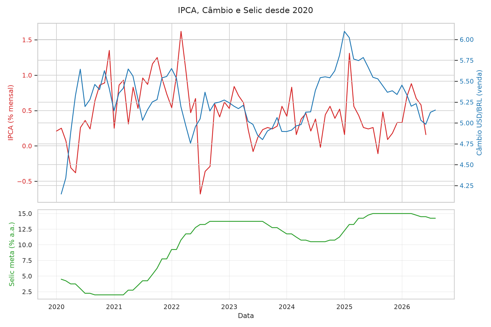

# Indicadores Macro Brasil

Análise exploratória de indicadores macroeconômicos brasileiros (IPCA, câmbio USD/BRL e Selic), com dados extraídos diretamente da API do Banco Central (SGS).

## Objetivo
Projeto de estudo aplicado, parte da minha transição de carreira para Análise de Dados/Finanças. Serve de base para conteúdo publicado no LinkedIn.

## Gráfico



## Como rodar
Requer Python 3.12.7.

```bash
python -m venv .venv
source .venv/bin/activate
pip install -r requirements.txt
jupyter lab notebooks/ipca_cambio.ipynb
```

Principais dependências: `pandas`, `matplotlib`, `seaborn`, `python-bcb`, `sqlalchemy` (o `requirements.txt` completo inclui as transitivas do Jupyter, geradas via `pip freeze`, para reprodutibilidade exata do ambiente).

## Estrutura
- `notebooks/ipca_cambio.ipynb` — coleta, exploração e visualização dos dados
- `outputs/` — gráficos gerados

## Fonte de dados
- Banco Central do Brasil — Sistema Gerenciador de Séries Temporais (SGS)
  - IPCA (série 433), Câmbio USD/BRL venda (série 1), Selic meta (série 432)

## Licença
Código livre sob [GPLv3](LICENSE) — copyright (c) 2026 Tulio Kaaz. Qualquer derivação deste projeto deve permanecer livre e aberta.